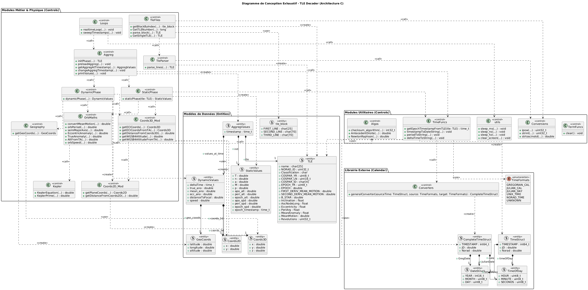

# 🛰️ Two-Line Elements (TLE) Decoder & Propagator

Un propagateur orbital temps réel écrit en C pur. Ce projet permet de décoder des données TLE (format 3LE) et de calculer en direct la position spatiale et géographique d'un satellite ou d'une station spatiale.


## 🌟 Fonctionnalités & Modèles Physiques

Ce projet ne se contente pas de lire un fichier texte, il recrée la mécanique spatiale nécessaire pour prédire la position de l'objet :

* **Calcul Orbital (Méthode de Kepler) :** Implémentation de la méthode de Kepler pour la propagation orbitale.
* **Résolution Numérique :** Utilisation de l'algorithme de **Newton-Raphson** pour isoler l'anomalie excentrique (E) à partir de l'anomalie moyenne.
* **Géodésie de Précision (WGS84) :** Conversion des coordonnées ECI (Earth-Centered Inertial) vers un référentiel géographique (Latitude, Longitude, Altitude) en utilisant une méthode itérative basée sur l'ellipsoïde WGS84.
* **Correction des Perturbations (J2) :** Intégration du facteur J2 pour compenser l'aplatissement de la Terre aux pôles (dérive du nœud ascendant et de l'argument du périastre).

## 🛠️ Architecture du Projet

Le code est séparé en plusieurs modules pour isoler les responsabilités physiques et mathématiques :
- `TleParser` : Extraction et typage des données depuis le format brut 3LE.
- `StaticPhase` : Calcul des constantes orbitales initiales (Demi-grand axe, période, vitesses aux apsides).
- `DynamicPhase` : Évolution temporelle de l'orbite (temps réel).
- `OrbMaths` & `Kepler` : Cœur mathématique (anomalies, équations de Kepler).
- `Geography` & `Coords3D` : Changements de référentiels et calculs topographiques WGS84.

### Diagramme UML du Projet



## 🚀 Compilation & Exécution

### Prérequis
- Un compilateur C (GCC recommandé)
- Python 3 (pour le script utilitaires de téléchargement)

### Installation

Cloner le dépôt avec ses sous-modules (gestionnaire de calendrier) :

```bash
git clone --recursive https://github.com/Jordi-R66/TLE-Decoder.git

cd TLE-Decoder
```

### Compiler

```bash
make compile
```

### Télécharger les données (TLE)

Télécharger les données TLE
Un script Python est fourni pour récupérer automatiquement les derniers TLE depuis Celestrak :

```bash
python3 download_tle.py
```

### Lancement (exemple avec l'ISS, NORAD ID 25544)

```bash
./build/TLE-Decoder TLEs/stations.tle 25544
```

## ⚠️ Limites Connues (Incompatibilité TLE / Kepler)

Afin de rester humble vis-à-vis de la physique spatiale, il est important de noter une limite mathématique inhérente à cette approche :
- Les données TLE sont des "éléments moyens" spécifiquement générés pour être utilisés avec les modèles mathématiques SGP4/SDP4.
- Ce propagateur utilise une approche Kepler + J2, ce qui signifie qu'il ignore la traînée atmosphérique et les perturbations gravitationnelles luno-solaires profondes. Par conséquent, l'utilisation de TLE avec ce modèle de Kepler entraîne une dérive progressive de la position sur le long terme. Les résultats restent très pertinents à court terme, mais une implémentation complète de SGP4 serait nécessaire pour une rigueur absolue.
- Les imprécisions liées aux nombres flottants (IEEE 754) font que des écarts sont observés.

## 🔗 Liens Utiles

[Wikipedia - TLE](https://fr.wikipedia.org/wiki/Param%C3%A8tres_orbitaux_%C3%A0_deux_lignes)

[CelesTrak (Source des TLE)](https://celestrak.org/NORAD/elements/)
